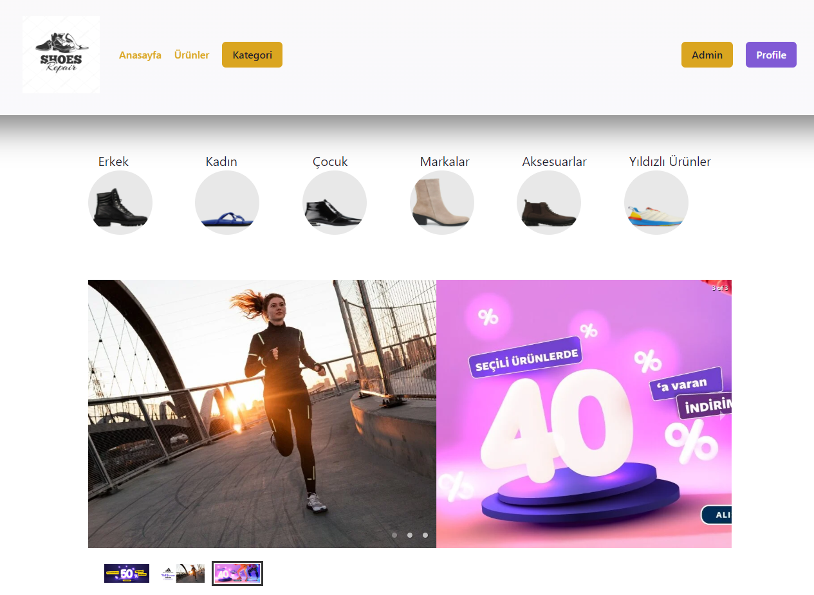
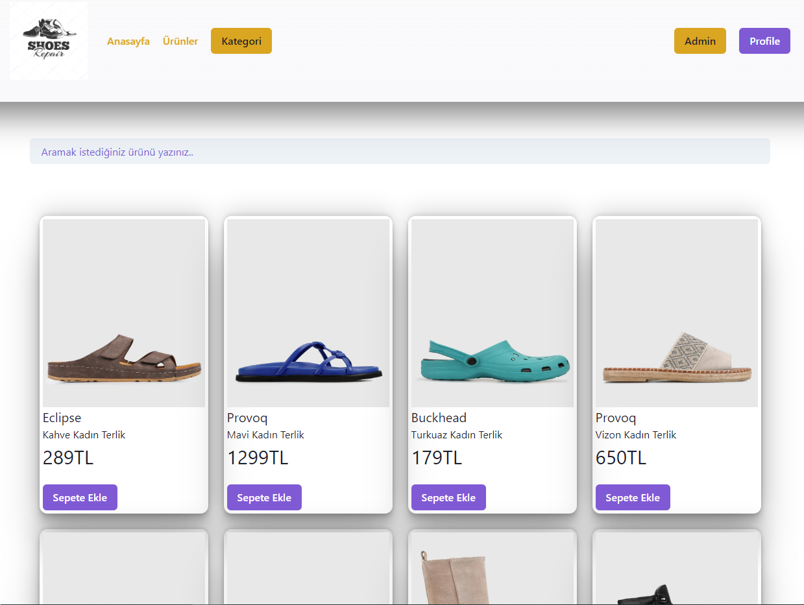
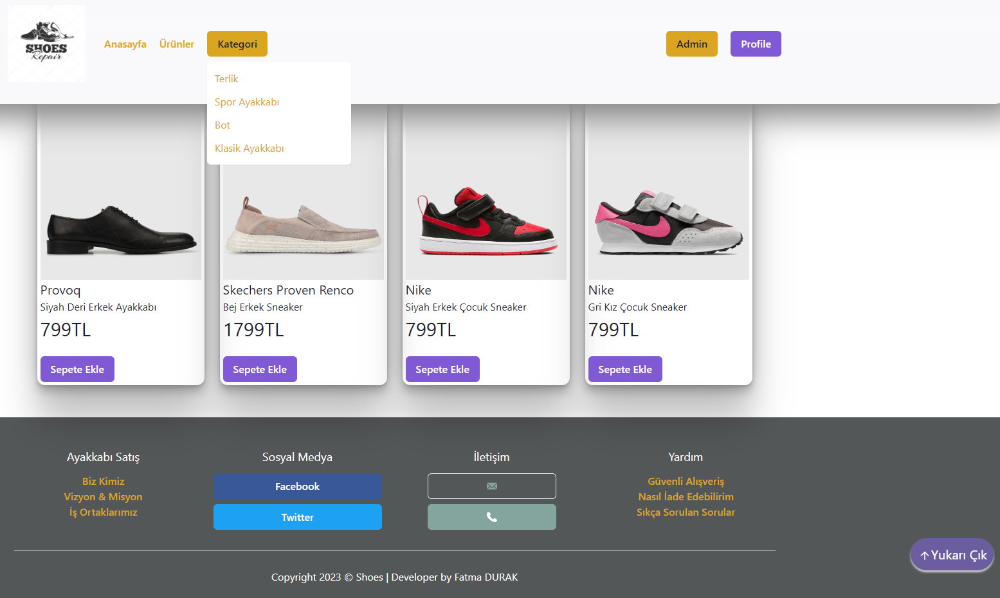
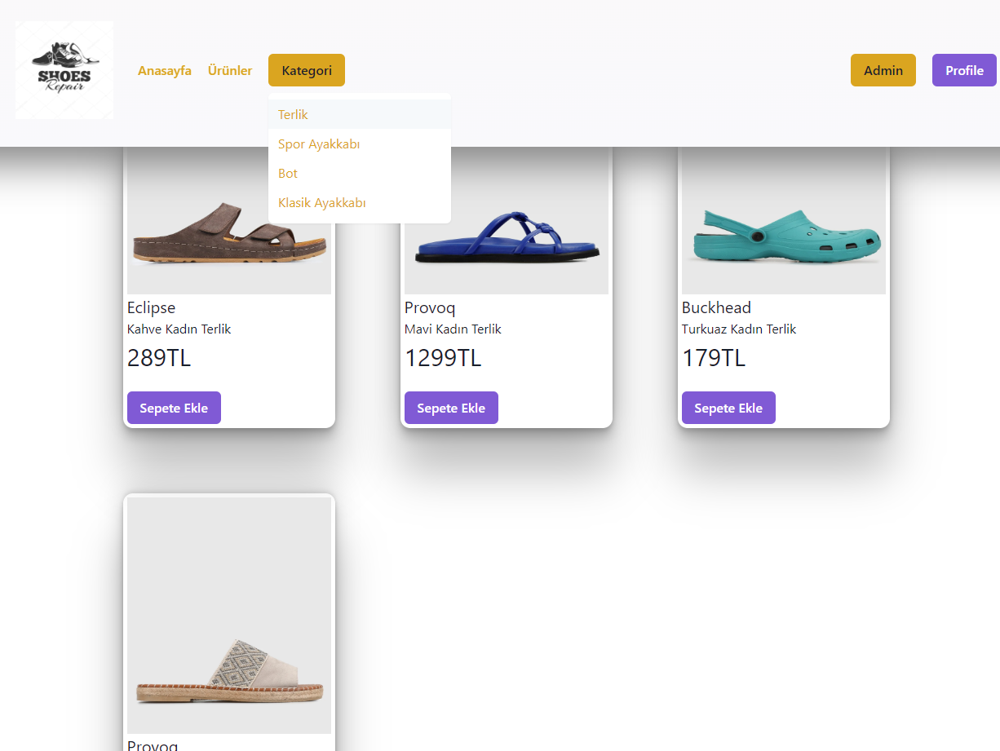
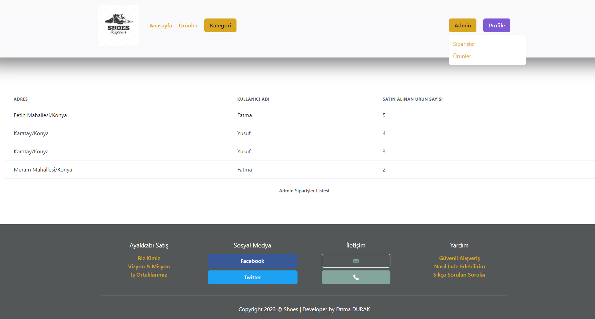
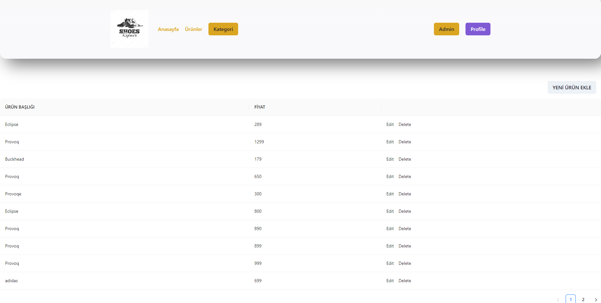
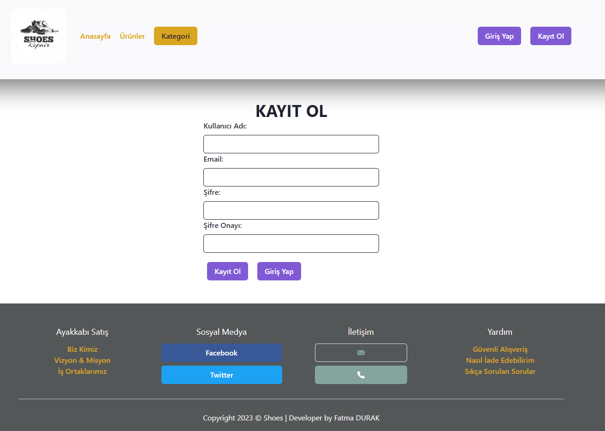
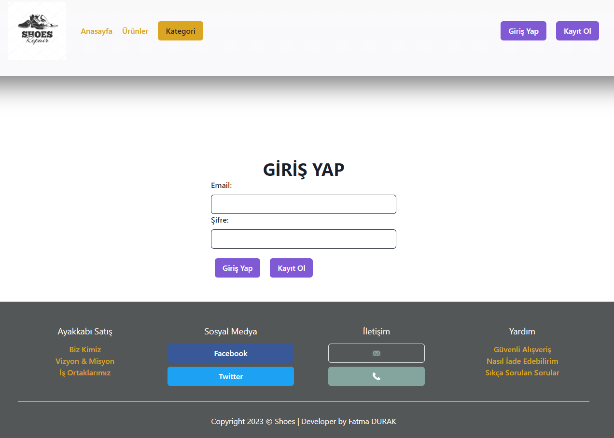
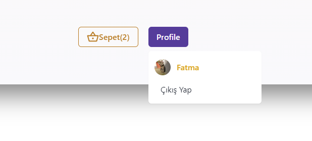
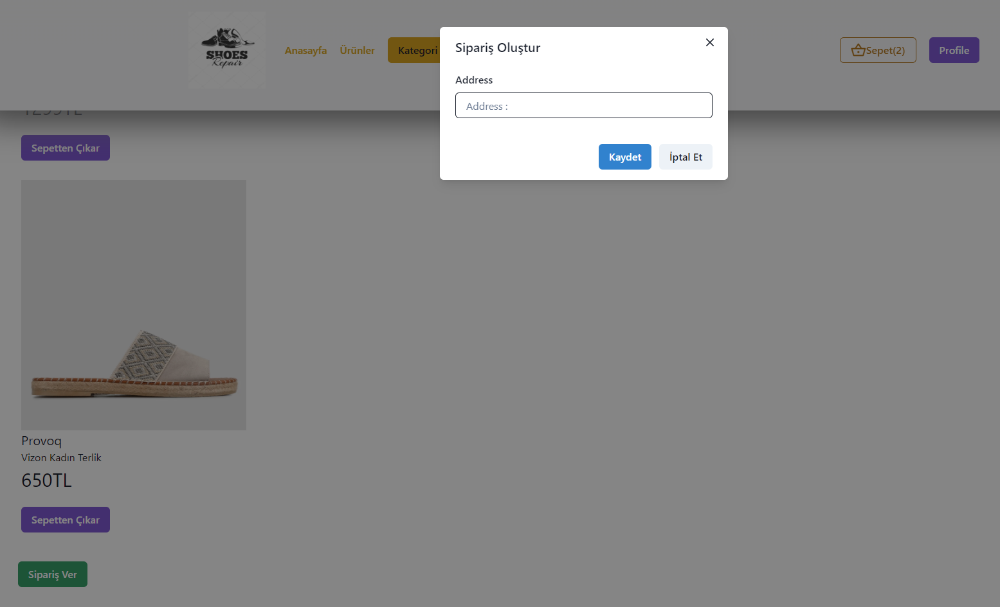

# ayakkabi-dunyasi
# React-AyakkabiDunyasi
* ```MockAPI``` ile fake JSON dosyası oluşturularak veriler axios ile çekildi. [https://mockapi.io](https://mockapi.io)
* Projede ```Context API ``` kullanıldı.
* Yeni üye girişi ve kayıt olunmuşsa giriş yapabilme, profil sayfasında profil bilgilerine erişebilme, sepete ürün ekleme, sepetten kaldırma,ürün arama, sipariş verebilme ,sepete eklenen ürünler ```local storage ```'a kaydolmaktadır, ürün detayını görebilme,  çıkış yapıldığında ana sayfaya yönlendirme özellikleri aktif çalışmaktadır. 
* UI tasarımda: [Chakra UI](https://chakra-ui.com/) ve [Ant Design](https://ant.design/) kullanıldı.
* Uygulama responsivedir.







,






